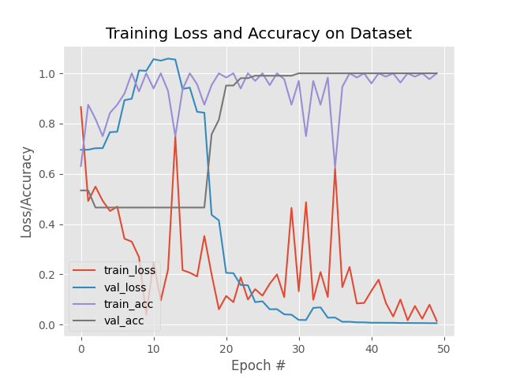

# [LivenessNet and MobilenetV3] DETECTING FRAUD IN FACIAL RECOGNITION SYSTEMS

Build a model capable of securing facial recognition systems against spoofing attacks, such as using masks, images, videos, etc., to deceive the recognition system.

## Overview
This study compares two machine learning models — LivenessNet and MobileNetV3 — designed to detect fraudulent activities in facial recognition systems. The performance of these models is evaluated using key metrics such as accuracy, precision, recall, and F1-score, which measure their ability to differentiate between real (genuine) and fake (spoofing) attempts.

Initial results indicate that LivenessNet outperforms MobileNetV3 across all evaluated metrics, achieving perfect accuracy, precision, and recall rates while also demonstrating a faster processing time. This makes LivenessNet a more robust solution for preventing fraud in facial recognition systems, particularly in scenarios where both speed and high detection rates are critical.

## Main Features
1. Collect the dataset by recording a video of a real face and a video from an electronic device (fake) 
2. Build a script to extract data from a video and split the dataset into 2 folders: real/fake.
3. Build 2 models LivenessNet and MobileNetV3
4. Data augmentation
5. Train model
6. Compare the results from the 2 models
7. Deploy the model on a real-time video stream
    
## Build Model
### Dataset
The dataset for training the models is collected by recording videos of real human faces and videos of faces displayed on electronic devices (such as smartphones, tablets, or monitors). This approach captures the nuances between genuine faces and fake representations, providing diverse data that helps the models learn to differentiate between the two. By including variations in lighting, angles, and device types, the models become more resilient to a wide range of spoofing techniques.

<p align="center">
  <br/>
  <i>Input images</i>
</p>

### Image Preprocessing
Resize images to 32x32 pixels to standardize input size for the model.  Convert the data list into a NumPy array. Then, normalize the data by dividing all pixel intensity values by 255 to scale the values to the range [0, 1]. Convert integer labels into One-Hot Encoded representations to prepare for model training. (Use 2 classes for the binary classification task.)
### Data Augmentation
Use the ImageDataGenerator class from the Keras library to perform data augmentation on the image training set. Data augmentation is a technique that generates more training samples from the existing dataset by applying random transformations to the images. This helps deep learning models avoid overfitting and improves generalization capability.
## Experiments:
The training/test loss curves for each experiment are shown below:
- **LinessNet**
  <br>

- **MobileNetV3**
  <br>


## Requirements:

* **python > 3.6**
* **opencv (cv2)**
* **numpy**
* **tensorflow**
* **matplotlib**

## How to use my code
- Clone this repository:
```bash
https://github.com/Khavanw/Face-Liveness-Detection.git
```
- Collect the dataset by recording a video of a real face and a video from an electronic device (fake)
- **structure**
```
videos/real
videos/fake
```
- Create Real image dataset:
```bash
python gather_examples.py --input videos/real --output dataset/real --detector detector --skip 4
```
- Create fake image dataset:
```bash
python gather_examples.py --input videos/fake --output dataset/fake --detector detector --skip 1
``` 
- Train model:
```bash
python train.py --dataset dataset --model model/livenessnet.py --le le.pickle 
```
